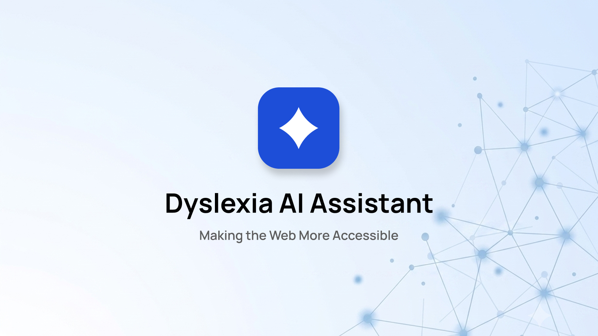

  

An accessible Chrome Extension (Manifest V3) designed to improve web readability and visual comfort for readers with dyslexia. Built with vanilla JavaScript, customizable typography, background tints, an interactive reading ruler, and on-demand AI paragraph summaries & text rewriting powered by Azure OpenAI.

---

## 🌟 Key Features

- **Dyslexia-Friendly Typography**: Toggle OpenDyslexic font with optimized line-height, letter-spacing, and word-spacing.
- **Text Scaling**: Dynamically scale body text size from 75% up to 150%.
- **Background Tinting**: Apply high-contrast tint overlays (Cream, Blue, Green) to reduce visual stress and glare.
- **Interactive Reading Ruler**: A subtle, mouse-tracking ruler bar to help maintain line focus while reading long passages.
- **On-Demand AI Paragraph Summaries**: Automatically detects main page content and inserts collapsible summary cards under long paragraphs.
- **Contextual Vocabulary ("Helpful Words")**: Extracts difficult terms and provides instant definitions within the paragraph overview.
- **Grade-Level Text Rewriting**: Simplify complex paragraphs to target reading levels (Grade 3 to Grade 12) with a single click.

---

## 🚀 Installation & Setup

### 1. Load the Extension into Google Chrome

1. Clone or download this repository to your local computer.
2. Open Google Chrome and navigate to `chrome://extensions/`.
3. Enable **Developer mode** using the toggle in the top-right corner.
4. Click **Load unpacked** and select the extension folder containing `manifest.json`.

### 2. Configure Azure OpenAI

1. Right-click the **Dyslexia AI Assistant** extension icon in your Chrome toolbar and select **Options** (or click details in `chrome://extensions/`).
2. Enter your Azure OpenAI credentials:
   - **Endpoint URL**: Your Azure resource endpoint (e.g., `https://<your-resource-name>.openai.azure.com`)
   - **Deployment Name**: Your Azure model deployment name (e.g., `gpt-4o-mini`)
   - **API Key**: Your secret Azure API key.
3. Click **Save Settings**.

---

## 🛠️ Usage

1. **Popup Menu Controls**:
   - Click the extension icon () in the toolbar to open the control panel.
   - Toggle **OpenDyslexic font**, adjust **Text size**, or pick a **Background tint**.
   - Toggle **Reading ruler** to follow your mouse cursor.
   - Turn on **AI paragraph summaries**.

2. **AI Assistance on Webpages**:
   - When **AI paragraph summaries** are enabled, a **"✦ Get AI overview"** banner appears under qualifying paragraphs on any webpage.
   - Expand the card to generate bulleted key points and a list of **Helpful words**.
   - Click **"Rewrite for Grade X"** to replace complex phrasing with simplified sentences matched to your selected reading grade.

---

## 🎨 Asset Guidelines

| Size        | Usage Context                                             | Asset Path    |
| :---------- | :-------------------------------------------------------- | :------------ |
| **16x16**   | Chrome Toolbar & Extension Menu Icon                      | `icon16.png`  |
| **48x48**   | Chrome Extensions Management Page (`chrome://extensions`) | `icon48.png`  |
| **128x128** | Chrome Web Store Listing & Installation Dialog            | `icon128.png` |

---

## 🔐 Security & Permissions

This extension requests minimal permissions required to function safely:

- `activeTab` & `scripting`: Required to apply styles, tints, reading rulers, and DOM modifications to the current active tab.
- `storage`: Used to save reader preferences locally and store API settings securely (`chrome.storage.sync`).
- `host_permissions` (`https://*.openai.azure.com/*`): Used strictly by `background.js` to communicate with your specified Azure OpenAI endpoint.

---

## 📄 License

MIT License. Feel free to modify and distribute.
